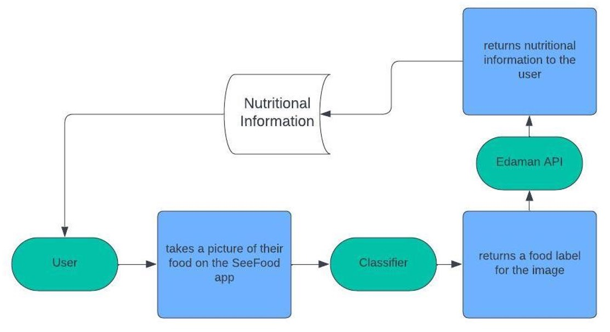
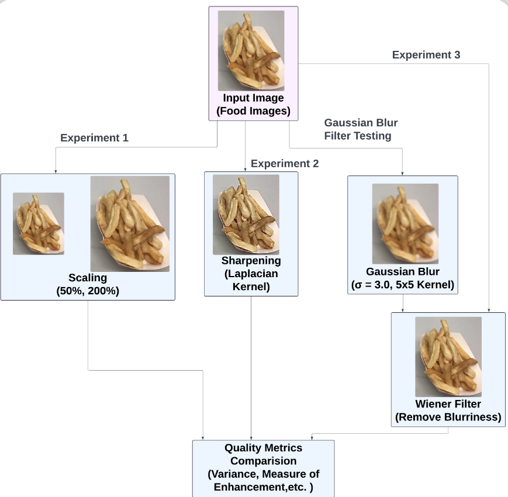

# SeeFood: Enhancing Food Image Classification

Welcome to the **SeeFood** project repository! This project combines both **Digital Image Processing (DIP)** and **Computer Vision (CV)** techniques to create a prototype framework for food image classification. Our goal is to enhance food image recognition through preprocessing techniques and machine learning, laying the groundwork for future applications in real-time food analysis.

---

## Features

### Digital Image Processing (DIP) Features
- **Sharpening**: 
  - Utilizes a Laplacian kernel to enhance edge features for better image clarity
- **Wiener Filtering**: 
  - Applies noise reduction with tunable sigma values to improve the quality of noisy or blurry images
- **Scaling**:
  - Ensures uniform dimensions for all images, enabling consistency during classification

### Computer Vision (CV) Features
- **Classification**:
  - Implements a pre-trained convolutional neural network (CNN) to classify images into predefined food categories
- **Category Focus**:
  - Uses a subset of the Kaggle Food-101 dataset for initial testing, including categories such as sushi, sashimi, and pizza
- **Performance Metrics**:
  - Evaluates the impact of preprocessing techniques on classification accuracy using quantitative metrics

---

## Future Work

- **Nutritional Analysis**:
    - Integrate the Edaman API to retrieve nutritional information for classified food items
- **Dataset Expansion**:
    - Include more categories and real-world variations, such as different lighting conditions and angles
- **Mobile Application**:
    - Transition the prototype into a real-time food recognition application

---

## Overall Project Scope

The flowchart below illustrates the **overall workflow of the SeeFood project**, from input image to classification output:

---

## Digital Image Processing Procedure

The following flowchart outlines the steps of the **Digital Image Processing (DIP) pipeline** used in this project:

